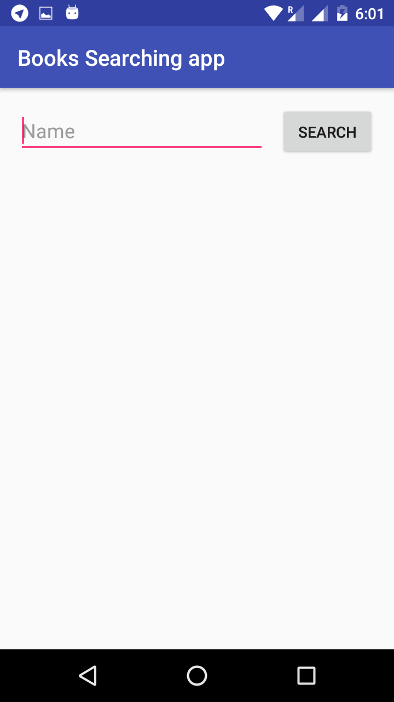

# Simple Books Searching app.

This is Books Searching app that show's the list of Books name and author name and Decisions of books using RecyclerView.

1) Its also show's how to use **Retrofit library** to make Network request.
2) Its also show's how to use **RecyclerView** to Display the list of Books name and author name and Decisions of books in ListView.
3) Its also show's how to use **Retrofit library** and get String Request and parse json.
4) Its also show's how to Hide keyboard in andorid.

This app is a part of Udacity android basics nanodegree Project.
Here is the Github Link for All android basics nanodegree Projects:-

https://github.com/akueisara/android-basics-nanodegree-by-google

## Screenshots:-

 
